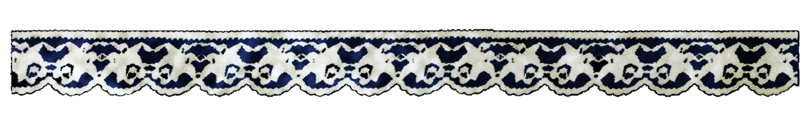
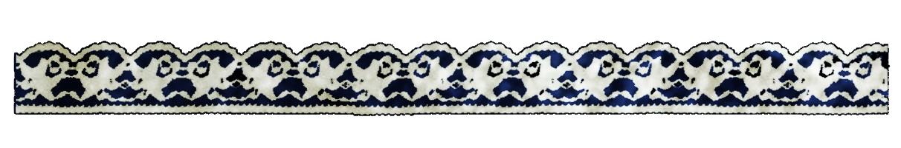

 
  

<table>
<tr>

<td>

</td>

<td>

$${\color{#dfddc7}⠀ Ⓑ⠀ⓤ⠀ⓝ⠀ⓖ⠀ⓞ }$$ 

$${\color{#bfbfbf} 𝚜𝚝𝚛𝚊𝚢⠀𝚍𝚘𝚐𝚜 }$$ 
$${\color{#bfbfbf}⠀    𝘫𝘶𝘯𝘬𝘪𝘦 }$$  

$${\color{#7f8cb5}⠀ 〝⠀𝘸𝘲𝘯𝘯𝘲⠀𝘱𝘭𝘲𝘺⠀𝘸𝘪𝘵𝘩⠀m𝘦?⠀〟  }$$ 

$${\color{#1d2d8a}⠀⠀ ⠀𝘲𝘳𝘵⠀𝘣𝘺⠀𝘮𝘦⠀⠀(𝘪𝘯𝘤𝘭𝘶𝘥𝘦⠀𝘱𝘧𝘱)⠀ }$$

<a href="https://signing-this.atabook.org">𝘴𝘪𝘨𝘯𝘲𝘵𝘶𝘳𝘦𝘴</a> 
$${\color{#111673}⠀ +⠀ }$$
<a href="https://rotting-bedroom.straw.page">𝘳𝘰𝘰𝘮</a>

</td>

</tr>
</table>

  
$${\color{#dfddc7}𝙝}$$ 
$${\color{#bfbfbf}𝙚}$$ 
$${\color{#7f8cb5}𝙖}$$ 
$${\color{#1d2d8a}𝙫}$$ 
$${\color{#111673}𝙮⠀}$$ 
  <a href="https://pin.it/5dSXnWYi8">𝘪 𝘯 𝘴 𝘱 𝘰</a> 

